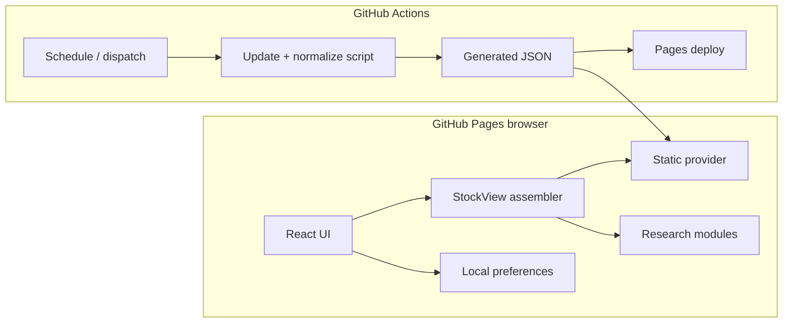
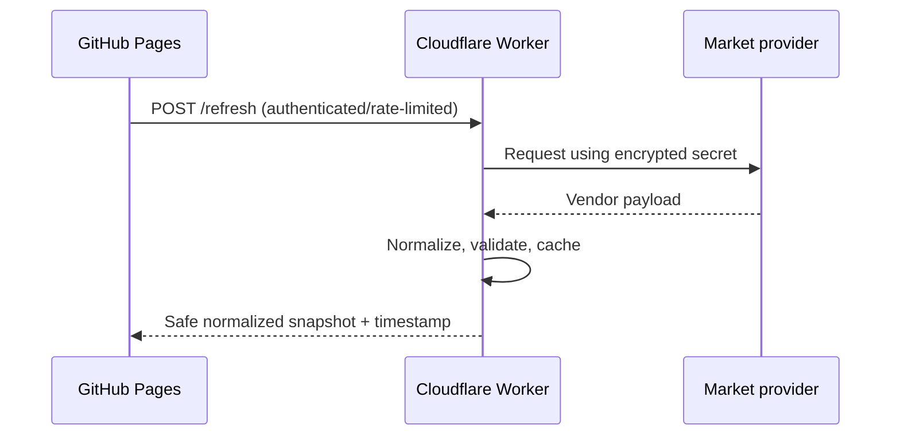

# Architecture

## System shape

The browser is untrusted and contains no secret. UI features depend on typed normalized models, not vendor payloads. Market, fundamental, research, industry/KPI, catalyst, risk, and history concerns are deliberately separate.

## Data flow

1. Data modules or generated JSON are loaded.
2. Validation rejects missing tickers, invalid timestamps, and scores outside 1–10.
3. `src/data/index.ts` joins normalized records by ticker into `StockView`.
4. Pages filter, sort, compare, and render those records.
5. Theme and watchlist classification persist in `localStorage`; no portfolio or brokerage data is transmitted.

## Scoring

Weights live in `src/config/scoring.ts`. Thesis is an authored research judgment in V1; the weighting helper supports later explainability and testing. Every factor uses 10 = strongest except **Risk Severity**, which explicitly uses 10 = highest risk and is inverted only inside risk adjustment.

## Provider abstraction

`MarketDataProvider` exposes `getQuote` and `getQuotes`. `StaticMarketDataProvider` is V1. A future implementation should translate a vendor response into internal `MarketQuote`, validate it, and write provider-independent JSON.

## Refresh architecture

The UI refresh only rereads the available static dataset. It communicates pending, success, failure, timestamp, staleness, and sample quality. GitHub Actions owns secure scheduled/manual generation. It calls the update script, validates, commits a changed snapshot, and triggers Pages deployment.

## GitHub Pages constraints

- Static origin: no secret storage or trusted server execution.
- Vite base is `/stock-command-center/`.
- Navigation avoids path routing; ticker detail uses a hash, which remains refresh-safe.
- Data changes become visible only after generated files are committed/deployed (or after a future endpoint is queried).

## Phase 2 secure refresh

The simplest next step is a small Cloudflare Worker with the provider key stored as a Worker secret, strict CORS for the Pages origin, rate limiting, short cache TTL, and schema validation. Do not put the key in Vite. Scheduled Actions can remain the durable fallback.

## Performance and accessibility

The app has no chart framework or routing dependency. Tables are desktop-first and convert to cards on mobile. Controls have labels and focus outlines, state uses text in addition to color, and reduced-motion preferences are respected.
